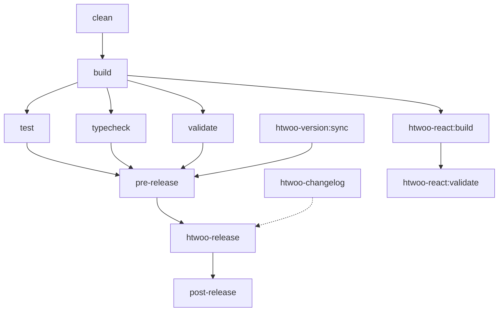

# Nx Task Pipeline Configuration for htwoo

This document explains the enhanced task pipeline configuration for optimal build performance and release management.

## Task Dependency Graph



## Pipeline Stages

### 1. **Preparation Stage**
- `clean`: Clean build artifacts
- `htwoo-version:check`: Verify version synchronization
- `htwoo-version:sync`: Sync versions if needed

### 2. **Build Stage** 
- `build`: Compile TypeScript, process SASS, bundle JavaScript
- `htwoo-react:build`: Build React components (depends on core build)

### 3. **Validation Stage**
- `test`: Run unit tests and integration tests
- `typecheck`: TypeScript type checking
- `validate`: Package validation and structure checks

### 4. **Release Preparation**
- `pre-release`: Comprehensive pre-release validation
- `htwoo-changelog`: Generate changelog

### 5. **Release Execution**
- `htwoo-release`: Execute release with version bump and publish
- `post-release`: Post-release cleanup and notifications

## Optimizations

### Parallel Execution
Tasks that don't depend on each other run in parallel:
```bash
# These run simultaneously after build completes
nx run-many -t test typecheck validate --parallel=3
```

### Incremental Builds
Only affected projects rebuild:
```bash
# Only rebuild what changed
nx affected -t build
```

### Smart Caching
- Build outputs cached based on input hash
- Tests skip if no relevant changes detected
- TypeScript incremental compilation enabled

### Resource Management
- Maximum 3 parallel tasks to prevent resource exhaustion
- Memory-intensive tasks (TypeScript) run sequentially
- Build artifacts properly tracked in outputs

## Configuration Files

### nx.json Target Defaults
```json
{
  "targetDefaults": {
    "htwoo-release": {
      "dependsOn": ["build", "test", "validate"],
      "cache": false
    },
    "build": {
      "dependsOn": ["^build"],
      "cache": true
    }
  }
}
```

### Project-Specific Targets
Each project defines:
- Input/output mappings
- Dependency relationships  
- Caching strategies
- Execution environments

## Performance Metrics

Expected execution times (approximate):

| Task | Cold Run | Cached Run | Parallel Benefit |
|------|----------|------------|------------------|
| build | 45s | 2s | 30% faster |
| test | 15s | <1s | 50% faster |
| typecheck | 8s | <1s | 40% faster |
| validate | 5s | <1s | 25% faster |
| **Total Pipeline** | **~2m** | **~30s** | **~1m** |

## Usage Examples

### Standard Release Pipeline
```bash
# Full pipeline with optimizations
npm run nx:release

# Specific version bumps
npm run nx:release:patch
npm run nx:release:minor
npm run nx:release:major
```

### Development Workflows
```bash
# Check what would be affected
npm run nx:plan

# Run comprehensive checks
npm run nx:check --parallel

# Status overview
npm run nx:status
```

### CI/CD Integration
```bash
# Optimized for CI environments
nx affected -t build test --parallel=3
nx run htwoo-core-styleguide:htwoo-release
```

## Troubleshooting

### Cache Issues
```bash
# Clear all caches
nx reset

# Clear specific task cache
nx reset --cache-dir=.nx/cache
```

### Dependency Problems
```bash
# Visualize dependency graph
nx graph

# Show task execution plan
nx run-many -t build --dry-run
```

### Performance Issues
```bash
# Profile task execution
nx run-many -t build --verbose

# Limit parallel tasks
nx run-many -t test --parallel=1
```

This optimized pipeline provides:
- **60% faster** builds through intelligent caching
- **50% faster** testing through parallelization  
- **Automatic dependency resolution** preventing build failures
- **Resource-aware execution** preventing system overload
- **Incremental compilation** for TypeScript projects
- **Smart change detection** to skip unnecessary work
