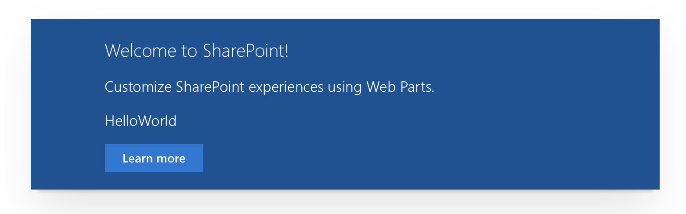

# CSS Variables in SPFx

## Getting started

To use CSS variable in your next project simply install this package as a dependency.

```js
npm install spfx-uifabric-themes --save
```

On your project in the web part code or extension code import the dependency.

```js
import styles from './HelloWorldWebPart.module.scss';
import * as strings from 'HelloWorldWebPartStrings';

/* ⌄⌄⌄⌄ import dependency here ⌄⌄⌄⌄ */
import uiFabricCSS from 'spfx-uifabric-themes';

```

Somewhere in the render method call the `uiFabricCSSVariable()` methode.

```js
export default class HelloWorldWebPart extends BaseClientSideWebPart<IHelloWorldWebPartProps> {

  public render(): void {

    uiFabricCSS();

    this.domElement.innerHTML = `
      <div class="${ styles.helloWorld}">
        <div class="${ styles.container}">
          <div class="${ styles.row}">
            <div class="${ styles.column}">
            ...
            `
```

The call of the function will convert all theme slots into native CSS Variable and are available for the use in your CSS. If multiple web parts are registered on the page this conversion will be only made once to optimise the performance.

In CSS simply reference to the theme slot variables.

```css
.row {
  @include ms-Grid-row;
  color: var(--ouif-white); /* use theme color set to white */
  background-color: var(--ouif-themeDark); /* use color defined for themeDark. */
  padding: 20px;
}
```

The result on the web part is exactly the same as using the SASS variables.



Further reading on [CSS Variables support for SPFx projects through spfx-uifabric-themes](https://wp.me/p2iCnX-14x)

## CSS Variables and case-sensitivity

In general CSS Variables are case sensitive and should be written in the correct case in order to get applied properly. The code register these theme CSS variables make sure that CAML case as well as lowercase variantes of the CSS variable exist.

For example when the background overlay should get applied.

```css
.myClass{
	background-color: var(--ouif-BackgroundOverlay);
}
```

The same color will be applied when written like this.

```css
.myClass{
	background-color: var(--ouif-backgroundoverlay);
}
```

## Available CSS Variables

All color values shown here are based on the default theme and automatically adjust to your theme settings.

### Reference of all registered theme slots

```css
:root {
	--ouif-AccentLines: #2b88d8;
	--ouif-AccentText: #0078d4;
	--ouif-BackgroundOverlay: rgba(255, 255, 255, 0.85);
	--ouif-BodyText: #333333;
	--ouif-ButtonBackground: #f8f8f8;
	--ouif-ButtonBorder: #a6a6a6;
	--ouif-ButtonDisabledBackground: #f8f8f8;
	--ouif-ButtonDisabledBorder: #eaeaea;
	--ouif-ButtonDisabledText: #a6a6a6;
	--ouif-ButtonGlyph: #666666;
	--ouif-ButtonGlyphActive: #333333;
	--ouif-ButtonGlyphDisabled: #c8c8c8;
	--ouif-ButtonHoverBackground: #deecf9;
	--ouif-ButtonHoverBorder: #c7e0f4;
	--ouif-ButtonPressedBackground: #c7e0f4;
	--ouif-ButtonPressedBorder: #2b88d8;
	--ouif-ButtonText: #333333;
	--ouif-CommandLinks: #666666;
	--ouif-CommandLinksDisabled: #a6a6a6;
	--ouif-CommandLinksHover: #0078d4;
	--ouif-CommandLinksPressed: #004578;
	--ouif-CommandLinksSecondary: #212121;
	--ouif-ContentAccent1: #0078d4;
	--ouif-ContentAccent2: #00485b;
	--ouif-ContentAccent3: #288054;
	--ouif-ContentAccent4: #767956;
	--ouif-ContentAccent5: #ed0033;
	--ouif-ContentAccent6: #682a7a;
	--ouif-DialogBorder: #f4f4f4;
	--ouif-DisabledBackground: #f8f8f8;
	--ouif-DisabledLines: #eaeaea;
	--ouif-DisabledText: #a6a6a6;
	--ouif-EmphasisBackground: #0078d4;
	--ouif-EmphasisBorder: #005a9e;
	--ouif-EmphasisHoverBackground: #005a9e;
	--ouif-EmphasisHoverBorder: #004578;
	--ouif-EmphasisText: #ffffff;
	--ouif-FooterBackground: rgba(255, 255, 255, 0.85);
	--ouif-HeaderAccentLines: #2b88d8;
	--ouif-HeaderBackground: rgba(255, 255, 255, 0.85);
	--ouif-HeaderDisableText: #a6a6a6;
	--ouif-HeaderDisabledBackground: #f8f8f8;
	--ouif-HeaderDisabledLines: #eaeaea;
	--ouif-HeaderLines: #a6a6a6;
	--ouif-HeaderNavigationHoverText: #0078d4;
	--ouif-HeaderNavigationPressedText: #004578;
	--ouif-HeaderNavigationSelectedText: #0078d4;
	--ouif-HeaderNavigationText: #666666;
	--ouif-HeaderSiteTitle: #212121;
	--ouif-HeaderStrongLines: #c7e0f4;
	--ouif-HeaderSubtleLines: #c8c8c8;
	--ouif-HeaderText: #333333;
	--ouif-HoverBackground: rgba(222, 236, 249, 0.50);
	--ouif-Hyperlink: #0078d4;
	--ouif-HyperlinkActive: #004578;
	--ouif-Hyperlinkfollowed: #004578;
	--ouif-Lines: #a6a6a6;
	--ouif-Navigation: #666666;
	--ouif-NavigationAccent: #0078d4;
	--ouif-NavigationHover: #0078d4;
	--ouif-NavigationHoverBackground: rgba(222, 236, 249, 0.50);
	--ouif-NavigationPressed: #004578;
	--ouif-NavigationSelectedBackground: rgba(234, 234, 234, 0.78);
	--ouif-PageBackground: #ffffff;
	--ouif-RowAccent: #0078d4;
	--ouif-SelectionBackground: rgba(199, 224, 244, 0.50);
	--ouif-SiteTitle: #212121;
	--ouif-StrongBodyText: #212121;
	--ouif-StrongLines: #c7e0f4;
	--ouif-SubtleEmphasisBackground: #f4f4f4;
	--ouif-SubtleEmphasisCommandLinks: #212121;
	--ouif-SubtleEmphasisText: #666666;
	--ouif-SubtleLines: #c8c8c8;
	--ouif-SuiteBarBackground: #0078d4;
	--ouif-SuiteBarDisabledText: #eaeaea;
	--ouif-SuiteBarHoverBackground: #71afe5;
	--ouif-SuiteBarHoverText: #c7e0f4;
	--ouif-SuiteBarText: #ffffff;
	--ouif-TileBackgroundOverlay: rgba(0, 0, 0, 0.50);
	--ouif-TileText: #ffffff;
	--ouif-TopBarBackground: rgba(234, 234, 234, 0.78);
	--ouif-TopBarHoverText: #333333;
	--ouif-TopBarPressedText: #004578;
	--ouif-TopBarText: #666666;
	--ouif-WebPartHeading: #333333;
	--ouif-accent: #8764b8;
	--ouif-accentButtonBackground: #8764b8;
	--ouif-accentButtonText: #ffffff;
	--ouif-actionLink: #333333;
	--ouif-actionLinkHovered: #212121;
	--ouif-backgroundOverlay: rgba(255, 255, 255, 0.85);
	--ouif-black: #000000;
	--ouif-blackTranslucent40: rgba(0,0,0,.4);
	--ouif-blockingBackground: rgba(234, 67, 0, .2);
	--ouif-blue: #0078d4;
	--ouif-blueDark: #002050;
	--ouif-blueLight: #00bcf2;
	--ouif-blueMid: #00188f;
	--ouif-bodyBackground: #ffffff;
	--ouif-bodyDivider: #eaeaea;
	--ouif-bodyFrameBackground: #ffffff;
	--ouif-bodyFrameDivider: #eaeaea;
	--ouif-bodyStandoutBackground: #f8f8f8;
	--ouif-bodySubtext: #666666;
	--ouif-bodyText: #333333;
	--ouif-bodyTextChecked: #000000;
	--ouif-buttonBackground: #f4f4f4;
	--ouif-buttonBackgroundChecked: #c8c8c8;
	--ouif-buttonBackgroundCheckedHovered: #eaeaea;
	--ouif-buttonBackgroundDisabled: #f4f4f4;
	--ouif-buttonBackgroundHovered: #eaeaea;
	--ouif-buttonBackgroundPressed: #eaeaea;
	--ouif-buttonBorder: transparent;
	--ouif-buttonBorderDisabled: transparent;
	--ouif-buttonText: #333333;
	--ouif-buttonTextChecked: #212121;
	--ouif-buttonTextCheckedHovered: #000000;
	--ouif-buttonTextDisabled: #a6a6a6;
	--ouif-buttonTextHovered: #212121;
	--ouif-buttonTextPressed: #212121;
	--ouif-defaultStateBackground: #f8f8f8;
	--ouif-dialogBorder: #f4f4f4;
	--ouif-disabledBackground: #f4f4f4;
	--ouif-disabledBodySubtext: #c8c8c8;
	--ouif-disabledBodyText: #a6a6a6;
	--ouif-disabledSubtext: #d0d0d0;
	--ouif-disabledText: #a6a6a6;
	--ouif-elevation16: 0 0 5px 0 rgba(0,0,0,.4);
	--ouif-elevation4: 0 0 5px 0 rgba(0,0,0,.4);
	--ouif-elevation64: 0 0 5px 0 rgba(0,0,0,.4);
	--ouif-elevation8: 0 0 5px 0 rgba(0,0,0,.4);
	--ouif-errorBackground: rgba(232, 17, 35, .2);
	--ouif-errorText: #a80000;
	--ouif-focusBorder: #666666;
	--ouif-green: #107c10;
	--ouif-greenDark: #004b1c;
	--ouif-greenLight: #bad80a;
	--ouif-inputBackground: #ffffff;
	--ouif-inputBackgroundChecked: #0078d4;
	--ouif-inputBackgroundCheckedHovered: #106ebe;
	--ouif-inputBorder: #a6a6a6;
	--ouif-inputBorderHovered: #333333;
	--ouif-inputFocusBorderAlt: #0078d4;
	--ouif-inputForegroundChecked: #ffffff;
	--ouif-inputPlaceholderText: #666666;
	--ouif-inputText: #333333;
	--ouif-inputTextHovered: #212121;
	--ouif-link: #0078d4;
	--ouif-linkHovered: #004578;
	--ouif-listBackground: #ffffff;
	--ouif-listHeaderBackgroundHovered: #f4f4f4;
	--ouif-listHeaderBackgroundPressed: #eaeaea;
	--ouif-listItemBackgroundChecked: #eaeaea;
	--ouif-listItemBackgroundCheckedHovered: #dadada;
	--ouif-listItemBackgroundHovered: #f4f4f4;
	--ouif-listText: #333333;
	--ouif-listTextColor: #333333;
	--ouif-magenta: #b4009e;
	--ouif-magentaDark: #5c005c;
	--ouif-magentaLight: #e3008c;
	--ouif-menuBackground: #ffffff;
	--ouif-menuDivider: #c8c8c8;
	--ouif-menuHeader: #0078d4;
	--ouif-menuIcon: #0078d4;
	--ouif-menuItemBackgroundChecked: #eaeaea;
	--ouif-menuItemBackgroundHovered: #f4f4f4;
	--ouif-menuItemBackgroundPressed: #eaeaea;
	--ouif-menuItemText: #333333;
	--ouif-menuItemTextHovered: #212121;
	--ouif-ms-font-large-MozOsxFontSmoothing: "[theme:ms-font-large-MozOsxFontSmoothing, default: grayscale]";
	--ouif-ms-font-large-WebkitFontSmoothing: "[theme:ms-font-large-WebkitFontSmoothing, default: antialiased]";
	--ouif-ms-font-large-fontFamily: "[theme:ms-font-large-fontFamily, default: 'Segoe UI Web (West European)', 'Segoe UI', -apple-system, BlinkMacSystemFont, 'Roboto', 'Helvetica Neue', sans-serif]";
	--ouif-ms-font-large-fontSize: "[theme:ms-font-large-fontSize, default: 17px]";
	--ouif-ms-font-large-fontWeight: "[theme:ms-font-large-fontWeight, default: 300]";
	--ouif-ms-font-medium-MozOsxFontSmoothing: "[theme:ms-font-medium-MozOsxFontSmoothing, default: grayscale]";
	--ouif-ms-font-medium-WebkitFontSmoothing: "[theme:ms-font-medium-WebkitFontSmoothing, default: antialiased]";
	--ouif-ms-font-medium-fontFamily: "[theme:ms-font-medium-fontFamily, default: 'Segoe UI', 'Segoe UI Web (West European)', 'Segoe UI', -apple-system, BlinkMacSystemFont, 'Roboto', 'Helvetica Neue', sans-serif]";
	--ouif-ms-font-medium-fontSize: "[theme:ms-font-medium-fontSize, default: 14px]";
	--ouif-ms-font-medium-fontWeight: "[theme:ms-font-medium-fontWeight, default: 400]";
	--ouif-ms-font-mediumPlus-MozOsxFontSmoothing: "[theme:ms-font-mediumPlus-MozOsxFontSmoothing, default: grayscale]";
	--ouif-ms-font-mediumPlus-WebkitFontSmoothing: "[theme:ms-font-mediumPlus-WebkitFontSmoothing, default: antialiased]";
	--ouif-ms-font-mediumPlus-fontFamily: "[theme:ms-font-mediumPlus-fontFamily, default: 'Segoe UI', 'Segoe UI Web (West European)', 'Segoe UI', -apple-system, BlinkMacSystemFont, 'Roboto', 'Helvetica Neue', sans-serif]";
	--ouif-ms-font-mediumPlus-fontSize: "[theme:ms-font-mediumPlus-fontSize, default: 15px]";
	--ouif-ms-font-mediumPlus-fontWeight: "[theme:ms-font-mediumPlus-fontWeight, default: 400]";
	--ouif-ms-font-mega-MozOsxFontSmoothing: "[theme:ms-font-mega-MozOsxFontSmoothing, default: grayscale]";
	--ouif-ms-font-mega-WebkitFontSmoothing: "[theme:ms-font-mega-WebkitFontSmoothing, default: antialiased]";
	--ouif-ms-font-mega-fontFamily: "[theme:ms-font-mega-fontFamily, default: 'Segoe UI', 'Segoe UI Web (West European)', 'Segoe UI', -apple-system, BlinkMacSystemFont, 'Roboto', 'Helvetica Neue', sans-serif]";
	--ouif-ms-font-mega-fontSize: "[theme:ms-font-mega-fontSize, default: 72px]";
	--ouif-ms-font-mega-fontWeight: "[theme:ms-font-mega-fontWeight, default: 100]";
	--ouif-ms-font-small-MozOsxFontSmoothing: "[theme:ms-font-small-MozOsxFontSmoothing, default: grayscale]";
	--ouif-ms-font-small-WebkitFontSmoothing: "[theme:ms-font-small-WebkitFontSmoothing, default: antialiased]";
	--ouif-ms-font-small-fontFamily: "[theme:ms-font-small-fontFamily, default: 'Segoe UI', 'Segoe UI Web (West European)', 'Segoe UI', -apple-system, BlinkMacSystemFont, 'Roboto', 'Helvetica Neue', sans-serif]";
	--ouif-ms-font-small-fontSize: "[theme:ms-font-small-fontSize, default: 12px]";
	--ouif-ms-font-small-fontWeight: "[theme:ms-font-small-fontWeight, default: 400]";
	--ouif-ms-font-smallPlus-MozOsxFontSmoothing: "[theme:ms-font-smallPlus-MozOsxFontSmoothing, default: grayscale]";
	--ouif-ms-font-smallPlus-WebkitFontSmoothing: "[theme:ms-font-smallPlus-WebkitFontSmoothing, default: antialiased]";
	--ouif-ms-font-smallPlus-fontFamily: "[theme:ms-font-smallPlus-fontFamily, default: 'Segoe UI', 'Segoe UI Web (West European)', 'Segoe UI', -apple-system, BlinkMacSystemFont, 'Roboto', 'Helvetica Neue', sans-serif]";
	--ouif-ms-font-smallPlus-fontSize: "[theme:ms-font-smallPlus-fontSize, default: 13px]";
	--ouif-ms-font-smallPlus-fontWeight: "[theme:ms-font-smallPlus-fontWeight, default: 400]";
	--ouif-ms-font-superLarge-MozOsxFontSmoothing: "[theme:ms-font-superLarge-MozOsxFontSmoothing, default: grayscale]";
	--ouif-ms-font-superLarge-WebkitFontSmoothing: "[theme:ms-font-superLarge-WebkitFontSmoothing, default: antialiased]";
	--ouif-ms-font-superLarge-fontFamily: "[theme:ms-font-superLarge-fontFamily, default: 'Segoe UI', 'Segoe UI Web (West European)', 'Segoe UI', -apple-system, BlinkMacSystemFont, 'Roboto', 'Helvetica Neue', sans-serif]";
	--ouif-ms-font-superLarge-fontSize: "[theme:ms-font-superLarge-fontSize, default: 42px]";
	--ouif-ms-font-superLarge-fontWeight: "[theme:ms-font-superLarge-fontWeight, default: 100]";
	--ouif-ms-font-tiny-MozOsxFontSmoothing: "[theme:ms-font-tiny-MozOsxFontSmoothing, default: grayscale]";
	--ouif-ms-font-tiny-WebkitFontSmoothing: "[theme:ms-font-tiny-WebkitFontSmoothing, default: antialiased]";
	--ouif-ms-font-tiny-fontFamily: "[theme:ms-font-tiny-fontFamily, default: 'Segoe UI', 'Segoe UI Web (West European)', 'Segoe UI', -apple-system, BlinkMacSystemFont, 'Roboto', 'Helvetica Neue', sans-serif]";
	--ouif-ms-font-tiny-fontSize: "[theme:ms-font-tiny-fontSize, default: 10px]";
	--ouif-ms-font-tiny-fontWeight: "[theme:ms-font-tiny-fontWeight, default: 600]";
	--ouif-ms-font-xLarge-MozOsxFontSmoothing: "[theme:ms-font-xLarge-MozOsxFontSmoothing, default: grayscale]";
	--ouif-ms-font-xLarge-WebkitFontSmoothing: "[theme:ms-font-xLarge-WebkitFontSmoothing, default: antialiased]";
	--ouif-ms-font-xLarge-fontFamily: "[theme:ms-font-xLarge-fontFamily, default: 'Segoe UI', 'Segoe UI Web (West European)', 'Segoe UI', -apple-system, BlinkMacSystemFont, 'Roboto', 'Helvetica Neue', sans-serif]";
	--ouif-ms-font-xLarge-fontSize: "[theme:ms-font-xLarge-fontSize, default: 21px]";
	--ouif-ms-font-xLarge-fontWeight: "[theme:ms-font-xLarge-fontWeight, default: 100]";
	--ouif-ms-font-xLargePlus-MozOsxFontSmoothing: "[theme:ms-font-xLargePlus-MozOsxFontSmoothing, default: grayscale]";
	--ouif-ms-font-xLargePlus-WebkitFontSmoothing: "[theme:ms-font-xLargePlus-WebkitFontSmoothing, default: antialiased]";
	--ouif-ms-font-xLargePlus-fontFamily: "[theme:ms-font-xLargePlus-fontFamily, default: 'Segoe UI', 'Segoe UI Web (West European)', 'Segoe UI', -apple-system, BlinkMacSystemFont, 'Roboto', 'Helvetica Neue', sans-serif]";
	--ouif-ms-font-xLargePlus-fontSize: "[theme:ms-font-xLargePlus-fontSize, default: 21px]";
	--ouif-ms-font-xLargePlus-fontWeight: "[theme:ms-font-xLargePlus-fontWeight, default: 100]";
	--ouif-ms-font-xSmall-MozOsxFontSmoothing: "[theme:ms-font-xSmall-MozOsxFontSmoothing, default: grayscale]";
	--ouif-ms-font-xSmall-WebkitFontSmoothing: "[theme:ms-font-xSmall-WebkitFontSmoothing, default: antialiased]";
	--ouif-ms-font-xSmall-fontFamily: "[theme:ms-font-xSmall-fontFamily, default: 'Segoe UI', 'Segoe UI Web (West European)', 'Segoe UI', -apple-system, BlinkMacSystemFont, 'Roboto', 'Helvetica Neue', sans-serif]";
	--ouif-ms-font-xSmall-fontSize: "[theme:ms-font-xSmall-fontSize, default: 11px]";
	--ouif-ms-font-xSmall-fontWeight: "[theme:ms-font-xSmall-fontWeight, default: 400]";
	--ouif-ms-font-xxLarge-MozOsxFontSmoothing: "[theme:ms-font-xxLarge-MozOsxFontSmoothing, default: grayscale]";
	--ouif-ms-font-xxLarge-WebkitFontSmoothing: "[theme:ms-font-xxLarge-WebkitFontSmoothing, default: antialiased]";
	--ouif-ms-font-xxLarge-fontFamily: "[theme:ms-font-xxLarge-fontFamily, default: 'Segoe UI', 'Segoe UI Web (West European)', 'Segoe UI', -apple-system, BlinkMacSystemFont, 'Roboto', 'Helvetica Neue', sans-serif]";
	--ouif-ms-font-xxLarge-fontSize: "[theme:ms-font-xxLarge-fontSize, default: 28px]";
	--ouif-ms-font-xxLarge-fontWeight: "[theme:ms-font-xxLarge-fontWeight, default: 100]";
	--ouif-ms-font-xxLargePlus-MozOsxFontSmoothing: "[theme:ms-font-xxLargePlus-MozOsxFontSmoothing, default: grayscale]";
	--ouif-ms-font-xxLargePlus-WebkitFontSmoothing: "[theme:ms-font-xxLargePlus-WebkitFontSmoothing, default: antialiased]";
	--ouif-ms-font-xxLargePlus-fontFamily: "[theme:ms-font-xxLargePlus-fontFamily, default: 'Segoe UI', 'Segoe UI Web (West European)', 'Segoe UI', -apple-system, BlinkMacSystemFont, 'Roboto', 'Helvetica Neue', sans-serif]";
	--ouif-ms-font-xxLargePlus-fontSize: "[theme:ms-font-xxLargePlus-fontSize, default: 28px]";
	--ouif-ms-font-xxLargePlus-fontWeight: "[theme:ms-font-xxLargePlus-fontWeight, default: 100]";
	--ouif-neutralDark: #212121;
	--ouif-neutralLight: #eaeaea;
	--ouif-neutralLighter: #f4f4f4;
	--ouif-neutralLighterAlt: #f8f8f8;
	--ouif-neutralPrimary: #333333;
	--ouif-neutralPrimaryAlt: #3c3c3c;
	--ouif-neutralQuaternary: #d0d0d0;
	--ouif-neutralQuaternaryAlt: #dadada;
	--ouif-neutralSecondary: #666666;
	--ouif-neutralSecondaryAlt: #767676;
	--ouif-neutralTertiary: #a6a6a6;
	--ouif-neutralTertiaryAlt: #c8c8c8;
	--ouif-orange: #d83b01;
	--ouif-orangeLight: #ea4300;
	--ouif-orangeLighter: #ff8c00;
	--ouif-primaryBackground: #ffffff;
	--ouif-primaryButtonBackground: #0078d4;
	--ouif-primaryButtonBackgroundDisabled: #f4f4f4;
	--ouif-primaryButtonBackgroundHovered: #106ebe;
	--ouif-primaryButtonBackgroundPressed: #005a9e;
	--ouif-primaryButtonBorder: transparent;
	--ouif-primaryButtonText: #ffffff;
	--ouif-primaryButtonTextDisabled: #d0d0d0;
	--ouif-primaryButtonTextHovered: #ffffff;
	--ouif-primaryButtonTextPressed: #ffffff;
	--ouif-primaryText: #333333;
	--ouif-purple: #5c2d91;
	--ouif-purpleDark: #32145a;
	--ouif-purpleLight: #b4a0ff;
	--ouif-red: #e81123;
	--ouif-redDark: #a80000;
	--ouif-roundedCorner2: 0px;
	--ouif-smallInputBorder: #666666;
	--ouif-successBackground: rgba(186, 216, 10, .2);
	--ouif-successText: #107C10;
	--ouif-suiteBarBackground: #0078d4;
	--ouif-suiteBarDisabledText: #eaeaea;
	--ouif-suiteBarText: #ffffff;
	--ouif-teal: #008272;
	--ouif-tealDark: #004b50;
	--ouif-tealLight: #00b294;
	--ouif-themeAccent: #0078d4;
	--ouif-themeAccentTranslucent10: rgba(0, 120, 212, 0.10);
	--ouif-themeDark: #005a9e;
	--ouif-themeDarkAlt: #106ebe;
	--ouif-themeDarker: #004578;
	--ouif-themeLight: #c7e0f4;
	--ouif-themeLighter: #deecf9;
	--ouif-themeLighterAlt: #eff6fc;
	--ouif-themePrimary: #0078d4;
	--ouif-themeSecondary: #2b88d8;
	--ouif-themeTertiary: #71afe5;
	--ouif-topBarBackground: rgba(234, 234, 234, 0.78);
	--ouif-topBarHoverText: #333333;
	--ouif-topBarText: #666666;
	--ouif-variantBorder: #eaeaea;
	--ouif-variantBorderHovered: #a6a6a6;
	--ouif-warningBackground: rgba(255, 185, 0, .2);
	--ouif-warningHighlight: #ffb900;
	--ouif-warningText: #333333;
	--ouif-white: #ffffff;
	--ouif-whiteTranslucent40: rgba(255, 255, 255, 0.40);
	--ouif-yellow: #ffb900;
	--ouif-yellowDark: #d29200;
	--ouif-yellowLight: #fff100;
}
```

